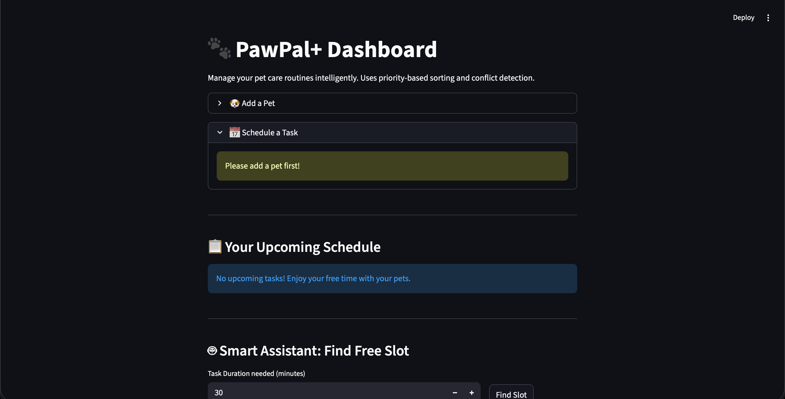

# PawPal+ 🐾

PawPal+ is a smart pet care management system built with Python and Streamlit. It helps pet owners plan, prioritize, and consistently manage care tasks for their furry friends using algorithmic scheduling.

## 📸 Demo

<a href="#" target="_blank"></a>

## ✨ Features (Smarter Scheduling)

- **Priority-Based Sorting:s** The scheduler organizes tasks dynamically. It prioritizes tasks flagged as "High" priority, ensuring crucial activities (like medications) are seen first, and secondary tasks are sorted chronologically.
- **Intelligent Conflict Detection:** Uses `timedelta` to check task durations. If you accidentally schedule a dog walk and a vet appointment at overlapping times, the system will flag a warning.
- **Automated Recurrence:** When you complete a "Daily" or "Weekly" task, the system automatically calculates the exact `datetime` for the next instance and adds it to your schedule.
- **Persistent Storage (Agent Mode Stretch):** Uses custom JSON serialization to save and load your `Owner`, `Pet`, and `Task` objects to a local `pawpal_data.json` file so you don't lose data on refresh.
- **Smart Availability (Agent Mode Stretch):** Calculates the next available free block of time based on existing tasks and durations.

## 🏗️ System Architecture (UML)

```
classDiagram
    class Owner {
        +String name
        +List~Pet~ pets
        +add_pet(Pet pet)
        +get_all_tasks() List~Tuple~
        +save_to_json(String filename)
        +load_from_json(String filename)$ Owner
    }
    
    class Pet {
        +String name
        +String species
        +int age
        +List~Task~ tasks
        +add_task(Task task)
    }
    
    class Task {
        +String id
        +String description
        +datetime due_time
        +int duration_mins
        +String priority
        +String frequency
        +bool is_completed
        +mark_complete() Task
    }
    
    class Scheduler {
        +Owner owner
        +get_upcoming_tasks(bool include_completed) List
        +check_conflicts() List~String~
        +find_next_available_slot(datetime start, int duration) datetime
        +complete_and_reschedule(String pet_name, String task_id) bool
    }

    Owner "1" *-- "many" Pet : Contains
    Pet "1" *-- "many" Task : Has
    Scheduler "1" o-- "1" Owner : Analyzes

```

## 🧪 Testing PawPal+

This project relies on robust backend logic verified by `pytest`.
To run the test suite:

```
python -m pytest tests/test_pawpal.py -v

```

**Coverage includes:**

1. Task state manipulation (completion logic).
1. Pet-to-Task relationship assignment.
1. Complex multi-variate sorting (Priority + Time).
1. `timedelta` based recurrence generation.
1. Duration-based interval conflict detection.

**Confidence Level:** ⭐⭐⭐⭐⭐
The core logic is entirely decoupled from Streamlit, allowing rigorous, deterministic testing of all algorithmic behavior.